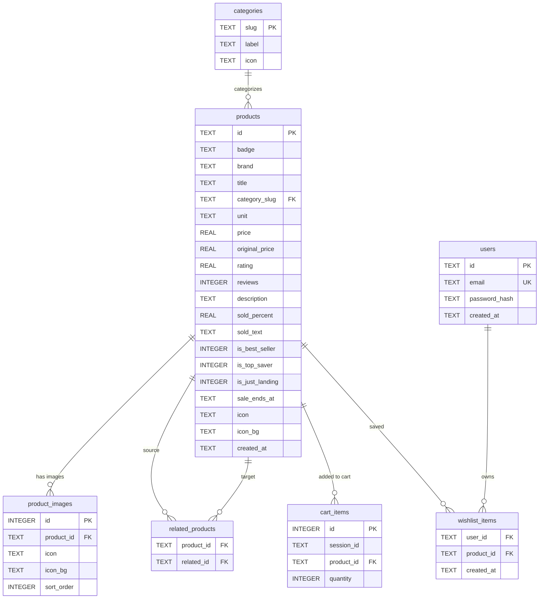

# Database Skill

You are helping the developer understand and maintain the Farmart SQLite database schema.

## Source of truth

Schema is defined in **`src/lib/db.ts → setupSchema()`**.  
Diagram lives in **`docs/er-diagram.md`** and **`public/mermaid.html`** (viewable at `http://localhost:3000/mermaid.html`).

## Current ER Diagram



## Table Reference

| Table | PK | FK | Key Columns |
|---|---|---|---|
| `categories` | `slug` | — | `label`, `icon` |
| `products` | `id` | `category_slug → categories.slug` | `price`, `original_price`, `rating`, `reviews`, `is_best_seller`, `is_top_saver`, `is_just_landing`, `sale_ends_at` |
| `product_images` | `id` (autoincrement) | `product_id → products.id` | `icon`, `icon_bg`, `sort_order` |
| `related_products` | `(product_id, related_id)` | both → `products.id` | — |
| `users` | `id` (UUID) | — | `email` (UNIQUE), `password_hash` |
| `cart_items` | `id` (autoincrement) | `product_id → products.id` | `session_id`, `quantity` (CHECK > 0); UNIQUE `(session_id, product_id)` |
| `wishlist_items` | `(user_id, product_id)` | `user_id → users.id`, `product_id → products.id` | `created_at` |

## Key constraints

- `cart_items` has `UNIQUE(session_id, product_id)` — POST to `/api/cart/items` uses `INSERT … ON CONFLICT DO UPDATE SET quantity = quantity + excluded.quantity` (upsert).
- `wishlist_items` PK is the composite `(user_id, product_id)` — inserting a duplicate throws, which the route returns as 409.
- `products.id` is a human-readable slug (e.g. `ice-birds-beer-350ml`), not an auto-increment — keep slugs kebab-case.
- `product_images.sort_order = 0` is the primary/hero image shown in the gallery first.
- `related_products` is one-directional — add both directions if you want bidirectional "related" links.

## How to respond based on the request

### "Show me the schema" / "What tables exist?"
Present the ER diagram and Table Reference above.

### "Add a new table / column" (feature work)
After making the schema change in `src/lib/db.ts`:

1. **Update `docs/er-diagram.md`** — add the new table/column to the `erDiagram` block and the Tables summary.
2. **Update `public/mermaid.html`** — find the `const diagram = \`erDiagram` string and apply the same additions so the live page at `/mermaid.html` stays in sync.
3. **Update this skill file** (`.claude/skills/database.md`) — add the new table to the ER diagram block and Table Reference above.
4. **Update `AGENTS.md`** (the Backend section) if the change affects architecture notes — e.g. a new auth table or a new session mechanism. `CLAUDE.md` is only a pointer to `AGENTS.md`; never write rules into it.
5. **Run `npm run db:reset`** then `npm run dev` so the new schema is applied to a fresh DB.

### "Check if the diagram is up to date"
Compare the `CREATE TABLE` statements in `src/lib/db.ts → setupSchema()` against the ER diagram in this skill. Report any tables or columns that are in the code but missing from the diagram, or vice versa.

### "Reset and verify seed"
```bash
npm run db:reset
# restart npm run dev, then:
curl -s http://localhost:3000/api/categories | python3 -m json.tool
curl -s "http://localhost:3000/api/products?limit=20" | python3 -m json.tool
```

## Update checklist (run this when schema changes)

When ANY table or column is added, removed, or renamed, update ALL of:

- [ ] `src/lib/db.ts` — `setupSchema()` SQL
- [ ] `src/lib/db.ts` — exported TypeScript types (`ProductRow`, `CategoryRow`, `ImageRow`, …)
- [ ] `src/lib/db.ts` — `seedIfEmpty()` if the new table needs seed rows
- [ ] `docs/er-diagram.md` — erDiagram block + Tables table
- [ ] `public/mermaid.html` — `const diagram` string
- [ ] `.claude/skills/database.md` (this file) — ER diagram block + Table Reference
- [ ] `AGENTS.md` — Backend section if architecture changes
