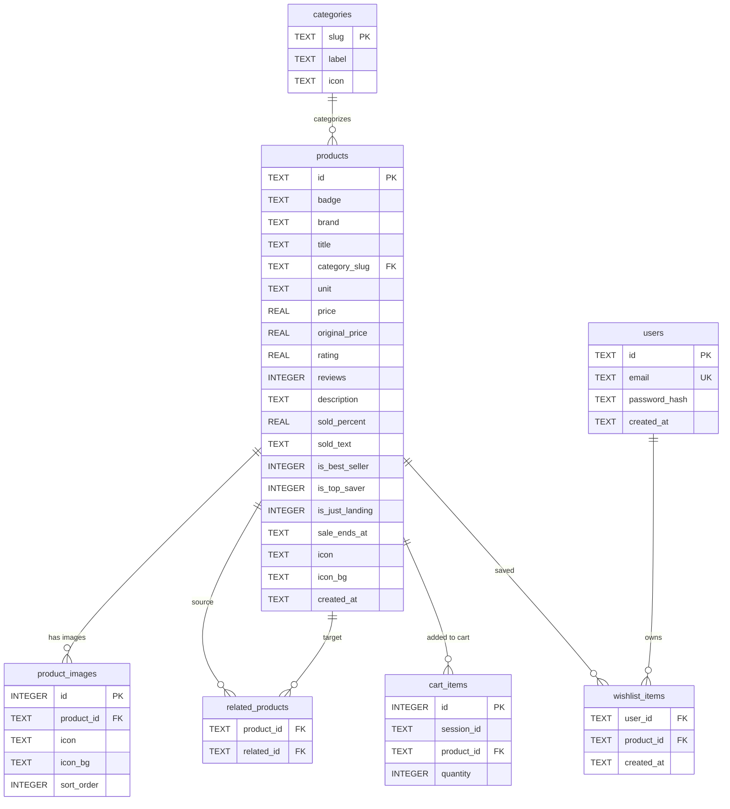

# Farmart — ER Diagram

Database: `farmart.db` · Engine: SQLite 3 (WAL mode) · ORM: `better-sqlite3`  
Schema source: `src/lib/db.ts`

## Tables

| Table | Columns | PK | FK |
|---|---|---|---|
| `categories` | 3 | `slug` | — |
| `products` | 19 | `id` | `category_slug` |
| `product_images` | 5 | `id` | `product_id` |
| `related_products` | 2 | `(product_id, related_id)` | `product_id`, `related_id` |
| `users` | 4 | `id` | — |
| `cart_items` | 4 | `id` | `product_id` |
| `wishlist_items` | 3 | `(user_id, product_id)` | `user_id`, `product_id` |
